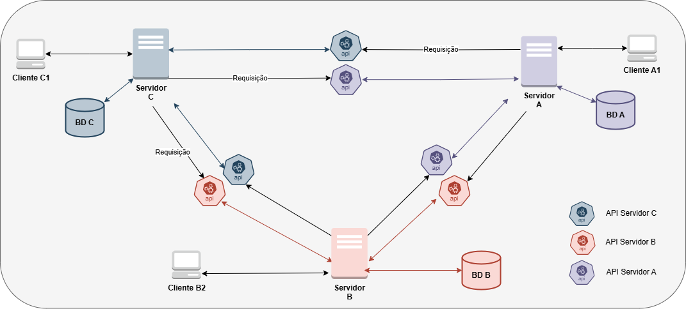
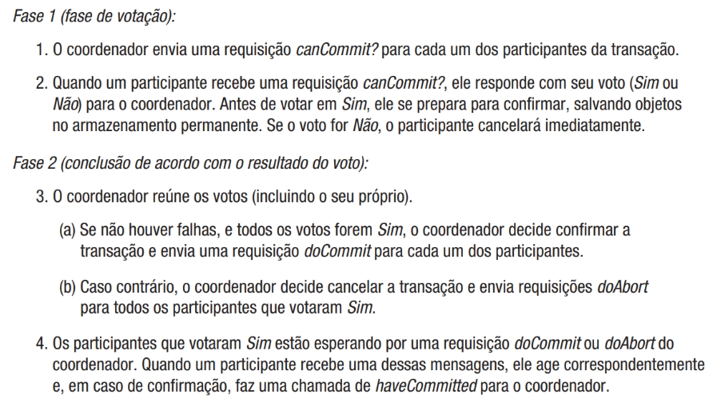
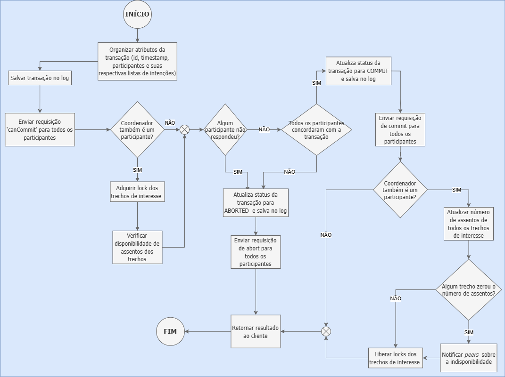
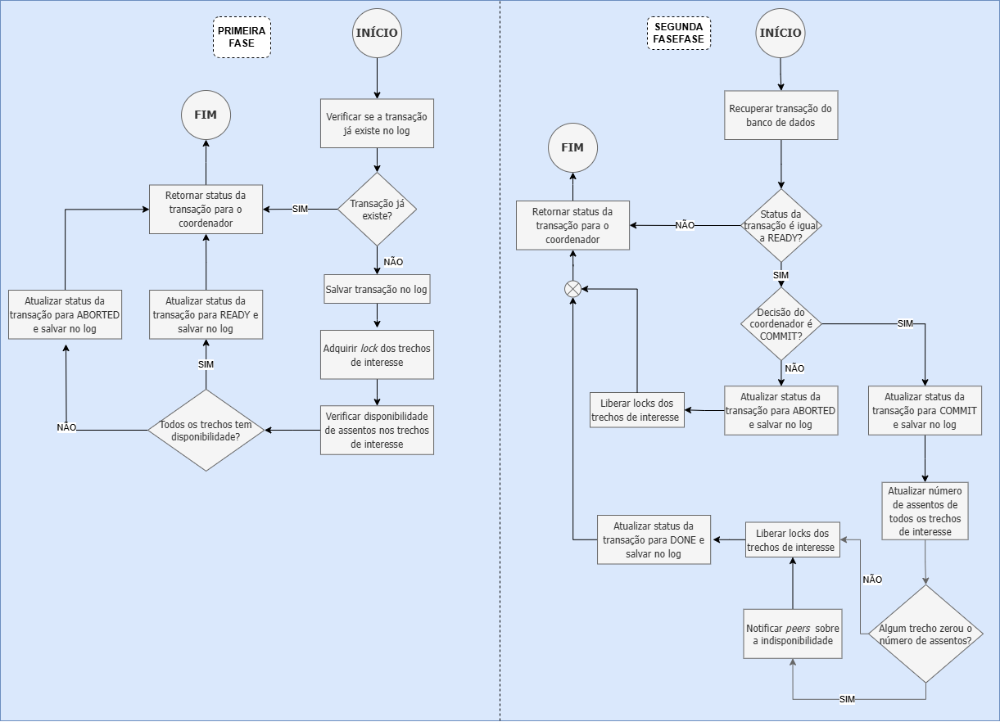

# **Introdução**

A aviação civil brasileira tem vivenciado um crescimento acelerado, impulsionado por diversos fatores tais como a globalização, a melhor distribuição de renda e a oferta de passagens aéreas mais acessíveis (Oliveira;Oliveira;Grande,2015, Bielschowsky; Custódio, 2011).  A crescente demanda por voos, associada a integração de companhias aéreas e a personalização de serviços, exigem soluções tecnológicas robustas para atender às expectativas dos consumidores.  

Neste cenário, a utilização de sistemas centralizados de vendas de passagens aéreas enfrentam limitações significativas. A integração dos dados de diversas companhias aéreas em um único sistema pode ser complexa e necessitar de alto investimento, além de serem mais suscetíveis a falhas.  

Este relatório apresenta o desenvolvimento de um sistema de venda de passagens aéreas distribuído utilizando a arquitetura peer-to-peer (P2P) e o algoritmo two-phase-commit (2PC) para o gerenciamento de transações distribuídas. A comunicação entre os servidores é realizada por meio de um API Rest. O sistema permite que os usuários consultem e comprem rotas compostas por trechos de diferentes companhias aéreas, além de apresentar uma menor suscetibilidade a falhas e uma maior escalabilidade. 

Este trabalho está organizado da seguinte forma: na sessão 1 foi apresentado o contexto do trabalho; na seção 2 será apresentada a metodologia do sistema, destacando a arquitetura desenvolvida,  o protocolo de comunicação e o protocolo de gerenciamento de transações distribuídas; na seção 3 serão apresentados e discutidos os resultados obtidos; e por fim, na seção 4 serão feitas as considerações finais do projeto.

# **Metodologia**

## **Arquitetura do sistema**

O sistema projetado adota o modelo *peer-to-peer* (P2P), no qual cada nó atua como cliente e servidor simultaneamente permitindo o compartilhamento de recursos e serviços computacionais (Coulouris, 2013; Rocha et al., 2004).  Este paradigma, além de promover a autonomia de nós, garante a descentralização do armazenamento, a ausência de um único ponto de falha e a disponibilidade dos dados e serviços a qualquer ponto (Rocha et al., 2004).  

A solução é composta por quatro entidades distintas: cliente, servidor,  interfaces de programação de aplicativos (APIs) e banco de dados. Os clientes são responsáveis por receber as entradas do usuário, formatá-las em um modelo válido de requisição, enviá-las ao servidor e, após, receber e processar as respostas e exibi-las ao usuário.   
O servidor é responsável pelo recebimento e processamento de requisições advindas tanto de clientes como de outros servidores a partir de interfaces distintas. No primeiro caso, o servidor fornece operações de cadastro, login, busca de passagens e de bilhetes, e compra de passagens por meio do protocolo de comunicação implementado para o problema 1\. No segundo caso, o servidor  disponibiliza operações para a compra distribuída de trechos por meio da API desenvolvida. O servidor, adicionalmente, gerencia a base de dados associada. 

O banco de dados encarrega-se do armazenamento das informações cruciais para o funcionamento dos serviços, tais como informações cadastrais dos clientes, informações sobre rotas, dados de emissão de bilhetes e registro de todas as transações sendo executadas.  

A API fornece uma interface de programação que permite o acesso remoto aos métodos do servidor, possibilitando a coordenação das transações distribuídas de compra e assegurando a integridade e consistência dos dados armazenados. Figura 1 detalha as entidades apresentadas e suas respectivas conexões.

  <figure>  
    
    <figcaption>
      
 

**Figura 1** - Entidade do sistema e suas conexões 
Fonte: Os autores

    </figcaption>
  </figure>

 

## **Protocolo de comunicação**

A API REST desenvolvida conta com 7 endpoints, que são métodos remotos. Tabela 1 descreve quais os endpoints, seus parâmetros, seu retorno e suas finalidades.

| Endpoint  | Parâmetros | Retorno | Finalidade |
| ----- | ----- | ----- | :---- |
|  / |  None |  msg:str | é o endpoint inicial da API, apenas informa sobre seu funcionamento |
|  /serverstatus |  None |  msg:str | endpoint utilizado para verirficar o status de um servidor, se ele esta ativo ou não |
|  /getgraph |  None |  graph:json | endpoint utilizado para solicitar toda a lista de adjacências de um servidor |
|  /newtransaction |  id:int data: dict time: array |  id:int msg:str | endpoint utilizado por um coordenador para informar o início de uma nova transação |
|  /commitdecision |  id:int msg:str |  msg:str | endpoint utilizado por um coordenador para informar se o commit deve ser realizado ou abortado |
|  /updateroute |  whoIsMe:str routeToUpdate:tuple msg:str |  msg:str | endpoint utilizado para atualizar  uma rota, adicionar ou mudar sua disponibilidade no grafo |

Tabela 1: Descrição dos endpoints da API   
Fonte: Os autores

## **Concorrência distribuída**

A fim de garantir a consistência dos dados armazenados pelos servidores e a atomicidade das transações de compra, o sistema adotou o protocolo *two-phase-commit* (2PC). O 2PC é um algoritmo de gerenciamento de transações distribuídas projetado para que as transações sejam executadas ou canceladas de forma consistente em todos os nós participantes (Coulouris, 2013). Neste contexto, caso um nó cancele sua parte da transação, toda a transação é cancelada.  

O protocolo 2PC consiste em dois subsistemas: participante e coordenador. O participante atua administrando a concorrência das transações localmente, ou seja, dentro do nó, e gerenciando a recuperação de falhas. Por sua vez, o coordenador supervisiona a execução completa das transações, distribuindo as subtarefas entre nós e autorizando as transações (Zhou, 2022). Cada nó pode implementar um dos subsistemas ou o coordenador pode ser associado ao nó em que a transação foi iniciada (Coulouris, 2013). O segundo modelo foi implementado no projeto.  

O algoritmo 2PC particiona a execução de uma transação em duas fases. Na primeira fase, denominada fase de votação, o coordenador da transação realiza uma votação entre os participantes a fim de decidir se a transação pode ser executada ou deve ser cancelada. Já na segunda fase, o coordenador compartilha com os participantes a decisão tomada.(Coulouris, 2013).   

Figura 2 apresenta o fluxo de comunicação de cada uma das fases do 2PC.

  <figure>  
    
    <figcaption>
      
 

Figura 2: Fluxo do protocolo 2PC  
Fonte: Coulouris, 2013, p.734

    </figcaption>
  </figure>

O algoritmo 2PC foi projetado para funcionar em sistemas síncronos e não considera falhas bizantinas. Técnicas como timeouts, persistência das transações e protocolos cooperativos podem ser implementadas para auxiliar na identificação e recuperação de falhas (Coulouris, 2013).  

Embora proporcione uma alta consistência em sistemas distribuídos, o protocolo 2PC apresenta um overhead considerável ocasionado pela comunicação entre o coordenador e todos os participantes da transação. Esta sobrecarga impacta negativamente a performance do sistema. Além disso, o bloqueio de recursos durante a execução da transação pode prolongar significativamente o tempo de espera por recursos.(Coulouris,2013; Stoic Programmer, 2022\)  

A escolha do algoritmo 2PC para o sistema de venda de passagens aéreas baseou-se na análise dos requisitos do sistema. Apesar de algoritmos de consenso como Raft e Paxos apresentarem maior disponibilidade e tolerância a falhas (ONGARO; OUSTERHOUT, 2014), o 2PC foi selecionado devido a necessidade de garantir uma alta consistência nas transações e evitar a venda duplicada de passagens. Figura 3 e 4 apresentam, respectivamente, o fluxo da rotina implementada para o coordenador de uma transação e o fluxo da rotina implementada para os participantes de uma transação.

  <figure>  
    
    <figcaption>
      
 

**Figura 3** - Rotina implementada para o coordenador de uma transação  
Fonte: Os autores

    </figcaption>
  </figure>

  <figure>  
    
    <figcaption>
      
 

**Figura 4** - Rotina implementada para o participante de uma transação  
Fonte: Os autores

    </figcaption>
  </figure>

Além do 2PC, o sistema implementa ainda o algoritmo de vetores lógico para a serialização do processamento de requisições localmente em cada nó, garantindo preferência sobre os trechos de uma rota ao cliente que comprou primeiro. O algoritmo de vetores lógicos, uma generalização dos relógios de Lamport, define que cada processo tem conhecimento dos contadores de todos os outros processos. Quando os processos se comunicam, os vetores são compartilhados e atualizados.(NATH, 2021\)  

A atualização dos vetores relógio é feita por meio de comparações. Um vetor é dito maior que outro se, e somente se, todos os seus elementos forem maiores ou iguais aos elementos do outro vetor. Caso nenhum dos vetores satisfaça esta condição, os vetores são denominados concorrentes.(NATH, 2021\) No sistema desenvolvido, o contador de um servidor é incrementado a cada transação iniciada e/ou requisição enviada a outro servidor. 

## **Confiabilidade do sistema**

Visando assegurar a confiabilidade da solução, foram implementadas rotinas de identificação e recuperação de falhas tanto no coordenador como nos participantes.  
Em ambos os subsistemas, todas as alterações realizadas nos estados das transações são persistidas no banco de dados. Dessa forma, em caso de falha, os nós podem recuperar as informações das transações que estavam executando, garantindo a continuidade do serviço e a integridade dos dados.  

O coordenador implementa a técnica de *timeout* para as solicitações de preparação de commit. Sendo assim, caso algum dos participantes não responda no tempo estabelecido, a transação é abortada, evitando longas esperas e bloqueio de recursos. Além disso, o coordenado identifica exceções e erros de conexão que podem ser gerados durante o envio de requisições. Caso a comunicação com um dos participantes seja encerrada durante a primeira fase, a trnsação é cancelada.

## **Roteamento de trechos**

A fim de permitir a pesquisa e venda de rotas que incluem a oferta de trechos de diversas companhias aéreas, foi implementado um algoritmo baseado no protocolo de roteamento de estado de link (ou de enlace). No roteamento por estado de link, cada roteador (ou nó) mantém localmente uma cópia da topologia lógica completa da rede e, a partir desta, constroi a sua tabela de roteamento por meio do algoritmo de Dijkstra (Silva, 2023; Kompella, 2023). A construção da topologia é realizada por meio do algoritmo de inundação (Kompella, 2023). 

No sistema desenvolvido, cada servidor mantém um mapa completo das conexões entre os destinos sobre o qual as requisições de consultas dos clientes são aplicadas. O grafo é construído a partir do algoritmo de inundação de forma que, a cada novo servidor adicionado ao cluster, ocorre o compartilhamento das informações dos trechos entre o novo servidor e todos os outros servidores anteriormente ativos. A partir deste compartilhamento, cada nó realiza a fusão do seu mapa com o novo grafo.  

Com a implementação deste algoritmo, o sistema mantém uma representação unificada e consistente das rotas disponíveis, além de garantir que os usuários tenham acesso às informações mais atualizadas sobre as rotas.

# **Resultados e discussões**

## **Organização do projeto: Docker e documentação**

A solução final desenvolvida consiste em uma API RESTful, que foi desenvolvida utilizando o framework de comunicação Flask. A API dispõe dos métodos remotos para o algoritmo de enlace, atualização do grafo e execução do 2PC. Cada servidor possui sua própria API, assim como seu banco de dados independente. Os bancos de dados foram implementados com o MongoDB, um modelo não relacional, escalável e que possui fácil integração com a linguagem Python.   

O banco de dados foi dividido em 5 coleções distintas, onde cada uma tem uma finalidade própria: logs, lista de adjacências, rotas, passagens e usuários. A fim de facilitar o gerenciamento das queries, foi implementada uma interface para os bancos de dados.  

Com relação ao sistema do cliente, foi mantida toda a implementação do problema 1, com a única e exclusiva alteração sendo a adição do campo que mostra a qual companhia um trecho pertence.  

O Docker foi utilizado no projeto para garantir sua portabilidade possibilitando a execução do software em qualquer computador que possua o software instalado. Contêineres distintos foram desenvolvidos para a aplicação do cliente, para o banco de dados do servidor e para hospedar o servidor propriamente dito. O banco de dados utiliza um container com a imagem do MongoDB Community, e o cliente e o servidor utilizam containers com uma imagem customizada do Python 3.12.4.  

A documentação do código foi feita seguindo o padrão Doxygen. Mesmo o Python não oferecendo suporte nativo a esse tipo de comentário, ele foi adotado por se adaptar melhor à descrição de métodos, funções, classes, variáveis e constantes implementadas.

## **Desempenho e avaliação do produto**

Para a realização dos testes dos métodos da API, foi utilizado o Postman, uma ferramenta gratuita para a realização de testes em APIs REST. Todos os endpoints foram testados e os retornos foram os esperados pelo sistema, comprovando a eficácia e o completo funcionamento da API. 

Com o intuito de aferir o desempenho da solução desenvolvida, foi empregado um algoritmo de simulação envolvendo 300 terminais de clientes, distribuídos em 100 
terminais para cada servidor. Os terminais realizaram simultaneamente a tentativa de comprar a mesma rota, uma passagem de Salvador até Belem, sendo esta 
composta por três trechos distintos: o trecho de Salvador até Fortaleza pertencente ao servidor A e contendo 100 assentos disponíveis; o trecho Fortaleza a 
Curitiba pertencente ao servidor B e contendo 150 assentos; e o trecho de Curitiba a Belém pertencente ao servidor C e contendo 150 assentos. Nesta compra, 
foram realizadas todas as etapas até a finalização de uma compra. 

Com apenas 100 vagas disponíveis, limite determinado pelo trecho com o menor número de assentos, apenas um terço dos terminais deveriam efetuar a compra. Ao executar o algoritmo, notou-se que todas as transações foram abortadas após um longo període de espera. Buscando compreender o motivo deste comportamento, todos os endpoints e funções foram testadas novamente. Como nenhum erro foi encontrado, o funcionamento do Socket e do framework Flask foram analisados. A partir desta análise, percebeu-se que o problema é ocasionado pelo gerenciamento de requisições do Flask. A versão do framework utilizada no projeto, por não ser própria para ambientes de produção, não consegue gerenciar múltiplas requisições simultaneamente, impossibilitando o correto funcionamento do algoritmo de transação distribuída implementado e, consequentimente, dos testes desenvolvidos.

Após a identificação do problema, realizou-se a tentativa de uma compra por vez em cada um dos servidores, as quais foram concluídas com sucesso.

# **Conclusões**

O presente trabalho descreveu o processo de desenvolvimento de uma aplicação distribuída elencando seus desafios, soluções e decisões de projeto que culminaram no presente produto.  
O sistema implementa a arquitetura *peer-to-peer* (P2P), que possibilitando a comunicação cliente-servidor e servidor-servidor. A comunicação entre cliente e servidor foi implementada por meio da API Socket Básica. Já para comunicação entre servidores foi implementada uma APIs com arquitetura *RESTful* e implementado o algoritmo *Two-Phase Commit* que permite a coordenação e o controle das transações distribuídas. O modelo implementado assegura a confiabilidade da aplicação distribuída e a consistência dos dados durante operações de venda e atualização dos grafos.   

Além disso, foi implementado um algoritmo baseado no estado de enlace (*link state*) para permitir a busca e venda de passagens oferecidas por todas as companhias do cluster a partir de qualquer servidor.  

A solução desenvolvida conseguiu atingir todos os requisitos elencados com excelência assim como obter um desempenho robusto no geral. Para trabalhos futuros, sugere-se a implementação de mecanismos mais complexos para validação dos usuários, além da possível criação de uma interface gráfica que permita ao sistema se tornar mais amigável aos usuários. Além disso, recomenda-se a troca do framework Flask para outra tecnologia que lide com múltiplas requisições tais como o FastAPI ou Django.

# 

# **Referências**

BIELSCHOWSKY, Pablo; CUSTÓDIO, Marcos da Cunha. A evolução do setor de transporte aéreo brasileiro. **Revista Eletrônica Novo Enfoque**, v. 13, n. 13, p. 72-93, 2011\.  
COULOURIS, George et al. **Sistemas Distribuídos: Conceitos e Projeto**. Bookman Editora, 2013\.  

KOMPELLA, Ram. **Lecture 10: Link State Routing. Princeton University**, 2023\. Disponível em: \<https://www.cs.princeton.edu/courses/archive/spring23/cos461/lectures/lec10-lsrouting.pdf\>. Acesso em: 01 nov. 2024\.  

NATH, Kousik .**All Things Clock Time And Order In Distributed Systems: Logical Clocks In Real Life**. Medium, 2022\. Disponível em: \<https://medium.com/geekculture/all-things-clock-time-and-order-in-distributed-systems-logical-clocks-in-real-life-2-ad99aa64753\>. Acesso em: 01 nov. 2024  

ONGARO, Diego; OUSTERHOUT, John. In search of an understandable consensus algorithm. In: **2014 USENIX annual technical conference (USENIX ATC 14\)**. 2014\. p. 305-319.  
OLIVEIRA, Jorge Henrique Caldeira de; OLIVEIRA, Thiago; GRANDE, Márcia Mazzeo. PRECIFICAÇÃO ESTRATÉGICA NO SETOR AÉREO NO BRASIL: O ESTUDO DE CASO DO PROCESSO DE FORMAÇÃO DE PREÇOS DE PASSAGENS AÉREAS EM UMA EMPRESA DE PEQUENO PORTE NO BRASIL. **Nucleus (16786602)**, v. 12, n. 2, 2015\.  

ROCHA, João et al. Peer-to-peer: Computação colaborativa na internet. In: **Minicursos do XXII Simpósio Brasileiro de Redes de Computadores (SBRC 2004\)**. sn, 2004\. Disponível em: https://www.inf.ufpr.br/aldri/disc/p2p\_sbrc2004\_texto\_final.pdf Acessado em: 01 nov. 2024  

SILVA, Acácio. **Capítulo 06: Roteamento e protocolos de roteamento**. Universidade de São Paulo, 2023\. Disponível em: \<https://lsi.usp.br/\~acacio/CCNA\_Cap06Mod02.pdf\>. Acesso em: 01 nov. 2024\.  
STOIC PROGRAMMER. **The Two-Phase Commit Protocol: Ensuring Distributed Transaction Consistency**. Medium, 2022\. Disponível em: \<https://medium.com/@stoic-programmer/the-two-phase-commit-protocol-ensuring-distributed-transaction-consistency-46d0239761db\>. Acesso em: 01 nov. 2024\.  

ZHOU, Kai. Tech Insights: **Two-Phase Commit Protocol for Distributed Transactions**. Medium, 2022\. Disponível em: \<https://alibaba-cloud.medium.com/tech-insights-two-phase-commit-protocol-for-distributed-transactions-ff7080eefe00\>. Acesso em: 01 nov. 2024\.
